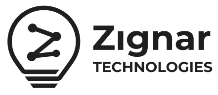

# Getting Started

## Support our Open-Source work by donating to our developers

We can only keep contributing on open source basis, with your support.
Help us with donations, so our team can spend full-time to the ecosystem.

> Donation pool for the Development Team (IOTA)
- `iota1qpjlty2fu9drlpahxqaqz9nsyg7f29nzfcdh6ugpcyqs2h2wjgrp7qywvlw`

> Donation pool for Hardware and Tools (IOTA)
- `iota1qz978pfse7tq0jtd44h8n3ssznthfj2wka89gg2cwey4lmkfktr0z6g4vg3`

<!-- 
    > PayPal donations:
    TODO: actually create this PayPal.me address
    https://paypal.me/zignartech
 -->

<!--
    TODO: Other Options:
    - Patreon
    - opensource funding pages 
-->

## Introduction

Welcome to Zignar Technologies Documentation application. In this application documents can be created, edited and published.

The documents in this application are written in simple Markdown language, as it is widely used in many websites around the world. Markdown is easy to use and easy to master. Markdown files with extension `.md` can be stored in any place inside the `/docs` folder or in subdirectories of that folder (i.e. `/docs/projects`), and the documentation system will automatically parse the new document and create the required links in the menu structure.

``` bash
.
└─ docs/
    ├─ index.md
    ├─projects/
    ├─ your_page.md
    ├─ some_other_page.md
    └─ some_other_directory/
```

Documents and Directories can be directly edited in the wiki GitHub repository by pressing the :material-pencil: icon at the top right corner of the page. Also, documents can be edited locally by cloning the `git` repository. To achieve this the following command can be used:

``` git
git clone https://github.com/Zignar-Technologies/wiki.git
```

Once the repository has been cloned or pulled, folders and markdown files can be added to the `/docs` directory structure, and later committed back on GitHub.

# Previewing as you write

Because the documentation system is based on Markdown files, any editor like VSCode or Atom can be used to preview your document as you write. However, the extended syntax that is used which provides better code blocks, content tabs, etc., will not be displayed fully. 

To achieve this, a live preview server that can also be accessed locally with a Web Browser, so that changes can be previewed as the documentation is written. The server will automatically rebuild the site upon saving your document. This server can be run directly by building a Docker image and running it.
## Installation

### with docker

To run the local preview server with docker:

``` bash linenums="1"
cd wiki
docker build -t zignardocs .
```

After the image is built, the server can be started it with the following command:

#### Unix, Powershell, macOS

    ``` bash linenums="1"
    docker run -itd -p 8000:8000 --name ZignarDocs -v ${PWD}:/docs zignardocs
    ```

#### Windows

    ``` bash linenums="1"
    docker run -itd -p 8000:8000 --name ZignarDocs -v ${PWD}:/docs zignardocs
    ```

Now, the live server can be accessed from a local browser at address `localhost:8000`

# Publishing your changes

The great thing about hosting project documentation in a `git` repository is
the ability to deploy it automatically when new changes are committed. As the code is already on [GitHub Pages][1], it's certainly the most convenient way to publish the project documentation and it's free of charge.
### GitHub Actions

A GitHub workflow runs every time that the files in the repository are created or changed, automatically publishing the changes to the `docs.zignar.io` website. This automates the deployment of the project documentation. When a new commit is pushed to the `main` branch, the static site is automatically built and deployed.

[1]: https://pages.github.com/##
